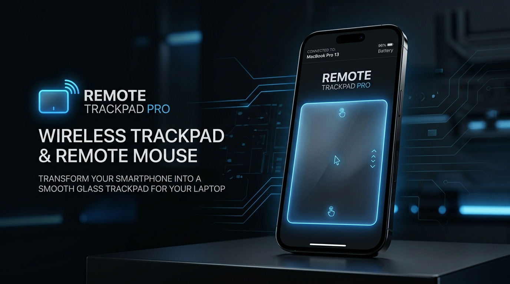
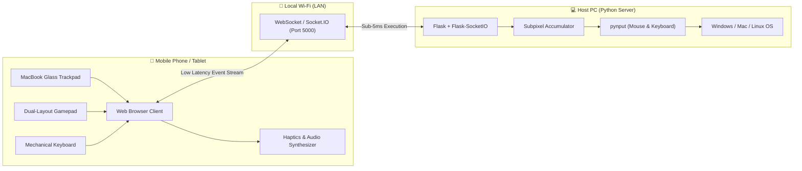

<div align="center">

# 🖱️ Remote Trackpad Pro
### Turn any Smartphone or Tablet into a MacBook-Grade Glass Trackpad, Pro Dual-Layout Gamepad & Physical Mechanical Keyboard for your PC.

[](https://www.python.org/)
[](https://flask.palletsprojects.com/)
[](https://socket.io/)
[](#)
[](#)

<br/>



</div>

---

## 🌟 Highlights

**Remote Trackpad Pro** is an open-source wireless peripheral server that transforms your mobile browser into a high-precision, MacBook-grade glass trackpad, a dual-layout console gamepad, and an authentic physical mechanical keyboard for your computer.

- **Zero Client Installations**: Runs entirely inside your mobile browser (Chrome, Safari, Edge, Samsung Internet). No apps or APKs to download.
- **Zero Kernel Drivers**: Directly commands user-space OS inputs via `pynput` with zero anti-cheat conflicts.
- **100% Offline & Private**: Works strictly over your local Wi-Fi network (LAN). Zero cloud telemetry or external dependencies.
- **Dual Tactile & Acoustic Engine**: Synthesizes real-time Cherry MX mechanical clicks and triggers hardware vibration waveforms (`navigator.vibrate`) for universal physical feedback on both Android and iOS.

> 📖 **Looking for full technical specifications, mathematical models, and network schemas?** Check out the comprehensive [PROJECT_DETAILS.md](PROJECT_DETAILS.md).

---

## ✨ Features

### 🖱️ 1. MacBook-Style Monolithic Glass Trackpad
- **Monolithic Satin Glass Surface**: Beautiful dark glass container (`#121319`) with Force Touch tactile active states.
- **Integrated Click Strip**: Left & Right click zones built directly into the bottom of the glass with a laser-etched divider.
- **Thumb-and-Glide Dragging**: Hold the Left Click zone with one thumb while moving another finger to smoothly select text or drag windows.
- **macOS Pointer Ballistics**: Piecewise velocity acceleration curve that allows single-pixel precision on slow moves and multi-monitor traversals on flicks.
- **`requestAnimationFrame` (rAF) Batching**: Batches touch updates aligned with your 60Hz/120Hz display refresh rate, eliminating network jitter.
- **Natural Inertial Momentum Scrolling**: Two-finger swipe in any direction with natural friction decay ($0.92$/frame) upon release.
- **Two-Finger Tap**: Tap anywhere with two fingers for an instantaneous Right Click.
- **Double-Tap & Hold Drag Lock**: Double-tap and hold to drag windows without holding physical buttons.
- **Dedicated Fullscreen Mode**: Top toolbar `[ ⛶ Fullscreen ]` button expands the glass trackpad edge-to-edge across `100vw` × `100dvh` with safe-area insets.

<div align="center">
  <table>
    <tr>
      <td align="center" width="50%">
        <br/><br/>
        <b>Standard Trackpad View</b><br/>
        <sub>Speed slider, status pill & integrated click zones</sub>
      </td>
      <td align="center" width="50%">
        <br/><br/>
        <b>Edge-to-Edge Fullscreen</b><br/>
        <sub>Flush edge-to-edge glass touch surface</sub>
      </td>
    </tr>
  </table>
</div>

---

### 🎮 2. Dual-Layout Pro Gamepad Console
A complete, driverless handheld controller designed for PC gaming with pixel-perfect dual layouts:

- **Layout 1: Asymmetric (Xbox Style)**:
  - Top-Left: Clover Petal 4-Way D-Pad.
  - Bottom-Left: Concentric Left Stick (WASD).
  - Top-Right: Concentric Right Stick (Camera Look / Mouse Aim).
  - Bottom-Right: ABXY Diamond with Force Touch neon lighting.
  - Shoulder & Bumpers: `LT`, `LB`, `RT`, `RB`, `LS`, `RS`.
- **Layout 2: Symmetric (PlayStation Style)**:
  - Top-Left: `LT` & `LB` shoulder buttons.
  - Mid-Left: Clover Petal 4-Way D-Pad.
  - Bottom: Symmetrical side-by-side concentric dual-thumbsticks.
  - Top-Right: `RT` & `RB` shoulder buttons.
  - Mid-Right: ABXY Diamond, `LS`, and `RS`.
- **Concentric Dual-Thumbsticks**:
  - Smooth 360° virtual stick with inner deadzone filtering.
  - 8-directional angular octant mapping (`W`, `A`, `S`, `D`, diagonals).
  - **Outer Sprint Ring**: Pushing the stick past the 82% outer boundary triggers sprint (`Shift`) with a dual-burst haptic vibration (`[35ms, 25ms, 45ms]`).
- **Dynamic Button Text Engine**:
  - Tap the status pill to cycle between:
    1. **Controller Names**: `A`, `B`, `X`, `Y`, `LB`, `LT`, etc.
    2. **In-Game Actions**: `JUMP`, `CROUCH`, `FIRE`, `AIM`, `RELOAD`, `USE`, `SPRINT`, `MELEE`.
    3. **PC Key Bindings**: `SPACE`, `C`, `M1`, `M2`, `R`, `E`, `SHIFT`, `V`.
  - **Live Customization Modal**: Long-press (750ms) any button to open an in-app modal to rename the label and rebind its PC key on the fly (saved in `localStorage`).
- **Gyroscope Motion Steering & Aiming**:
  - Tap the center `( 📱 )` icon to toggle motion steering in racing games or motion aiming in shooters.
- **Edge-to-Edge Fullscreen Fitting**:
  - Dynamically scales using responsive `vmin` units to fill 100% of any smartphone display (16:9, 19.5:9, 21:9) with zero letterboxing.

<div align="center">
  <table>
    <tr>
      <td align="center" width="50%">
        <br/><br/>
        <b>Layout 1: Asymmetric (Xbox Style)</b><br/>
        <sub>Top D-Pad, lower Left Stick, upper Right Stick & ABXY diamond</sub>
      </td>
      <td align="center" width="50%">
        <br/><br/>
        <b>Layout 2: Symmetric (PlayStation Style)</b><br/>
        <sub>Dual lower thumbsticks, top shoulder triggers & clover D-Pad</sub>
      </td>
    </tr>
  </table>
</div>

---

### ⌨️ 3. Physical Mechanical Keyboard
A full reproduction of an authentic 80% / Tenkeyless (TKL) physical mechanical keyboard:

- **Full Physical Key Layout**:
  - **Function Row**: `Esc`, `F1`–`F4`, `F5`–`F8`, `F9`–`F12` with authentic spacing gaps.
  - **Number Row**: Dual-character legends (`` ` `` / `~`, `1` / `!`, etc.) and wide `Backspace ⌫`.
  - **QWERTY Row**: `Tab ⇥` (1.5u), `Q`–`P`, `[`, `]`, `\`.
  - **Home Row**: `Caps Lock` (1.75u), `A`–`L`, `;`, `'`, and wide `Enter ↵` (2.25u).
  - **Shift Row**: Left `⇧ Shift` (2.25u), `Z`–`/`, and Right `⇧ Shift` (2.75u).
  - **Bottom Row**: `Ctrl`, `Win`, `Alt`, 6.25u wide `Spacebar`, `Alt`, `Fn`, `Ctrl`.
  - **Navigation Block**: `PrtSc`, `ScrLk`, `Pause`, `Ins`, `Home`, `PgUp`, `Del`, `End`, `PgDn`.
  - **Inverted-T Arrow Cluster**: Standalone directional cluster (`↑`, `←`, `↓`, `→`).
- **Acoustic Cherry MX Switch Synthesizer**:
  - Web Audio API synthesizes realistic mechanical switch acoustics on every keystroke:
    - **Alpha/Numeric Keys**: 1750Hz tactile snap click + 220Hz bottom-out clack.
    - **Spacebar**: Deep hollow stabilizer thud (140Hz) + metallic spring snap.
    - **Enter / Backspace / Shift**: Heavy stabilized mechanical clack.
  - Top toolbar toggle: `[ 🔊 Click Sound: ON / OFF ]`.
- **Smart Modifier Latching**:
  - Tapping `Shift` dynamically reveals uppercase letters and symbols across the keyboard.
  - Tapping `Caps Lock` toggles green LED indicators on the key and top bar.
  - Tapping `Ctrl` or `Alt` latches the modifier in blue, enabling effortless mobile execution of combos like `Ctrl + C`, `Ctrl + V`, and `Alt + Tab`.
- **Dedicated Fullscreen Mode**: Tap `[ ⛶ Fullscreen ]` for a full-width typing console.

<div align="center">
  <br/>
  <b>80% / TKL Mechanical Keyboard Console with Realistic Keycap Geometry & Cherry MX Acoustics</b>
</div>

---

### 🎵 4. Media & System Controller
- Instant playback controls: `⏮ Prev`, `⏯ Play/Pause`, `⏭ Next`.
- Volume toggles: `🔉 Vol -`, `🔇 Mute`, `🔊 Vol +`.

<div align="center">
  <br/><br/>
  <b>Dedicated Media & Master Volume Controls</b>
</div>

---

## 📱 Live Mobile Previews

<div align="center">

### 🖱️ Touchpad & Media Controls (Portrait)

<table>
  <tr>
    <td align="center" width="33%">
      <br/><br/>
      <b>MacBook Glass Trackpad</b><br/>
      <sub>Speed slider, status header & integrated click zones</sub>
    </td>
    <td align="center" width="33%">
      <br/><br/>
      <b>Edge-to-Edge Fullscreen</b><br/>
      <sub>Flush edge-to-edge touch surface</sub>
    </td>
    <td align="center" width="33%">
      <br/><br/>
      <b>Media & Volume Controls</b><br/>
      <sub>Instant playback & master volume control</sub>
    </td>
  </tr>
</table>

<br/>

### 🎮 Dual-Layout Pro Gamepad (Landscape)

<table>
  <tr>
    <td align="center" width="50%">
      <br/><br/>
      <b>Layout 1: Asymmetric (Xbox Style)</b><br/>
      <sub>Top D-Pad, lower Left Stick, upper Right Stick & ABXY diamond</sub>
    </td>
    <td align="center" width="50%">
      <br/><br/>
      <b>Layout 2: Symmetric (PlayStation Style)</b><br/>
      <sub>Dual lower thumbsticks, top shoulder triggers & clover D-Pad</sub>
    </td>
  </tr>
</table>

<br/>

### ⌨️ Physical Mechanical Keyboard Console (Landscape)

<p align="center">
  <br/>
  <b>Authentic 80% / TKL Mechanical Deck with Cherry MX Switch Acoustics & Haptic Actuation</b>
</p>

</div>

---

## 🎮 Gestures Cheat Sheet

| Gesture | Action | Feedback |
| :--- | :--- | :--- |
| **1-Finger Drag** | Move Mouse Cursor (velocity ballistics) | Real-time motion |
| **1-Finger Tap** | Left Click | 30ms mechanical click |
| **1-Finger Double Tap** | Double Click | Double click haptic |
| **1-Finger Long Press (>500ms)** | Right Click (Context Menu) | Dual-pulse vibration |
| **Double Tap & Hold** | Drag Lock (Window / Selection drag) | 45ms lock sensation |
| **2-Finger Drag** | Natural Vertical & Horizontal Scroll | Continuous scroll |
| **2-Finger Flick** | Inertial Momentum Glide (decay stop) | Physics momentum |
| **2-Finger Tap** | Secondary (Right) Click | Dual-pulse vibration |
| **Bottom Left Zone** | Left Click / Thumb-and-Glide | 30ms crisp click |
| **Bottom Right Zone** | Right Click | Dual-pulse vibration |
| **Gamepad Thumbstick** | 8-Directional WASD Movement | 22ms on touch/release |
| **Gamepad Sprint Ring** | Push stick past 82% radius (Shift/Sprint) | Dual-burst `[35ms, 25ms, 45ms]` |
| **Mechanical Key Press** | Types letter / number on PC | Cherry MX click + 28ms haptic |
| **Spacebar Press** | Sends Space to PC | Hollow stabilizer thud + 36ms haptic |

---

## 🏗️ Architecture



---

## 🚀 Quick Start

### 1. Prerequisites
- Python 3.9 or higher installed on your computer.
- Both your computer and phone connected to the **same local Wi-Fi network** (or phone hotspot).

### 2. Clone the Repository
```powershell
git clone https://github.com/AgrShubham/remote_mouse.git
cd remote_mouse
```

### 3. Install Dependencies
```powershell
pip install Flask Flask-SocketIO pynput
```

### 4. Start the Server
```powershell
python server.py
```
The server will print your active LAN IP address:
```text
 * Running on all addresses (0.0.0.0)
 * Running on http://127.0.0.1:5000
 * Running on http://192.168.x.x:5000
```

### 5. Connect from your Phone
1. Open any mobile browser (Chrome, Safari, Edge, etc.).
2. Navigate to:
   ```text
   http://<YOUR_PC_IP>:5000
   ```
3. The interface loads instantly with **`Connected ✔`** status!

---

## 🛠️ Configuration & Settings

- **Sensitivity Slider**: Adjust trackpad sensitivity on mobile from `0.5×` to `3.5×` in real time.
- **Port**: Default is `5000`. You can change it in [server.py](server.py) by modifying the `port` argument in `socketio.run()`.
- **Button Remapping**: Long-press any gamepad button for 750ms to rename it and rebind its PC key.

---

## ❓ Troubleshooting

<details>
<summary><b>Page is not loading on my phone?</b></summary>

1. **Verify same Wi-Fi**: Make sure your phone is not using mobile data and is connected to the same Wi-Fi router or hotspot as your PC.
2. **Check Windows Firewall**:
   - Allow Python through Windows Defender Firewall when prompted, or create an inbound rule for TCP port `5000`.
   - In PowerShell (Admin):
     ```powershell
     New-NetFirewallRule -DisplayName "Remote Mouse Port 5000" -Direction Inbound -LocalPort 5000 -Protocol TCP -Action Allow
     ```
3. **Verify Local IP**: Run `ipconfig` in PowerShell to ensure your IPv4 address hasn't changed.
</details>

<details>
<summary><b>Haptics / Vibration not working on iOS?</b></summary>

- Apple Safari disables `navigator.vibrate` on web pages.
- **Our Solution**: The app automatically synthesizes real-time acoustic mechanical switch clicks and micro-transient pulses via the Web Audio API, giving immediate physical feedback on iOS devices!
</details>

---

## 🗺️ Roadmap
- [x] MacBook-Style Monolithic Glass Trackpad with Force Touch click zones
- [x] Multi-Waveform Haptic Engine & Web Audio acoustic click synthesis
- [x] Natural Two-Finger Inertial Momentum Scrolling
- [x] Full Physical Mechanical Keyboard (TKL layout, Cherry MX sound synthesizer, modifier latching)
- [x] Dual-Layout Gamepad Console (Asymmetric & Symmetric, dynamic labels, live remap modal, concentric dual sticks)
- [x] Dedicated Fullscreen Modes across Trackpad, Gamepad, and Keyboard
- [x] Gyroscope Motion Steering & Aiming
- [ ] Customizable Macro Buttons & App Shortcuts
- [ ] QR Code Terminal Display for Instant Phone Pairing

---

## 📄 License

This project is licensed under the MIT License — see the [LICENSE](LICENSE) file for details.

---

<div align="center">
  <sub>Crafted with passion for seamless remote productivity and gaming.</sub>
</div>
