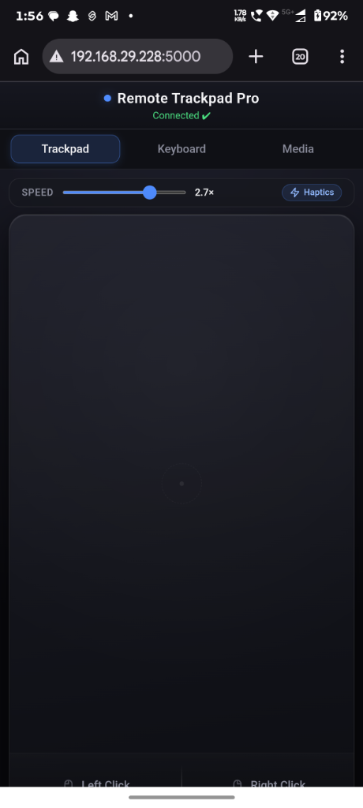
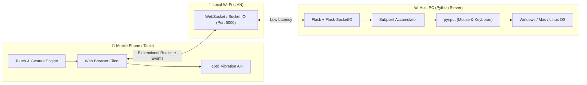

<div align="center">

# 🖱️ Remote Trackpad Pro
### Turn any Smartphone or Tablet into a Silky-Smooth Glass Trackpad, Keyboard & Media Controller for your PC.

[](https://www.python.org/)
[](https://flask.palletsprojects.com/)
[](https://socket.io/)
[](#)
[](#)

<br/>


</div>

---

## 🌟 Highlights

**Remote Trackpad Pro** is an open-source wireless peripheral server that transforms your mobile browser into a premium, MacBook-grade haptic trackpad and remote control center. 

No apps to install on your phone — simply connect to the same Wi-Fi network, navigate to your local IP in any browser (Chrome, Safari, Edge, Samsung Internet), and enjoy instant, lag-free control of your desktop.

---

## ✨ Features

### 🖥️ MacBook-Style Glass Trackpad
- **Integrated Monolithic Surface**: Expansive dark satin glass design with tactile Force Touch visual depression.
- **Merged Click Zones**: Left & Right click pads built directly into the bottom of the glass surface with a laser-etched divider.
- **Thumb-and-Drag**: Hold the Left Click zone with one thumb while gliding another finger to effortlessly drag windows, select text, or draw.
- **Safe-Area Inset Support**: Automatically adapts to dynamic mobile viewports (`100dvh`), placing controls safely above Android and iOS home gesture bars.

### ⚡ Multi-Waveform Haptic Engine
- **Left Click**: Crisp 14ms mechanical micro-click.
- **Right Click**: Distinct dual-pulse haptic pattern (`[18ms, 30ms, 22ms]`) so you can feel the difference without looking.
- **Touch Gestures**: Micro-ticks on taps and inertial momentum scrolling.
- **Visual Pulse**: Animated HUD badge pulse for devices where physical vibration is muted.

### 🚀 Liquid-Smooth Physics & Ballistics
- **macOS Pointer Ballistics**: Velocity-based non-linear acceleration. Slow finger movements yield single-pixel precision; quick flicks effortlessly traverse multiple monitors.
- **`requestAnimationFrame` (rAF) Batching**: Batches high-frequency touch updates to match your 60Hz/120Hz display, eliminating Wi-Fi packet flooding and network stutter.
- **Natural Two-Finger Scrolling with Inertial Glide**: Two-finger swipe in any direction. Releasing with speed triggers natural momentum decay ($0.92$/frame) that gently glides to a stop.
- **Subpixel Accumulator**: Server-side remainder tracking ensures micro-movements are never truncated by OS mouse coordinate rounding.

### ⌨️ Full Keyboard & Shortcut Suite
- Send full text or single key strokes with a single tap.
- Dedicated shortcut cluster: `Enter`, `Backspace`, `Tab`, `Esc`, `Delete`, `Home`, `End`, `PageUp`, `PageDown`, and `Arrow Keys`.

### 🎵 Media Controller
- Quick playback controls: `Play/Pause`, `Previous`, `Next`.
- Volume toggles: `Volume Up`, `Volume Down`, and instant `Mute`.

### 🎮 DualSense / Steam Deck-Style Remote Gamepad
- **Zero-Driver Universal Compatibility**: Natively emulates PC inputs via `pynput`—works instantly with 100% of PC games without requiring kernel drivers or third-party emulators.
- **360° Virtual Analog Thumbstick**: Smooth thumb-follow with inner spring return, deadzone filtering, and auto-sprint ring (push to edge for Shift/Sprint).
- **Precision ABXY Diamond**: Tactile mechanical-switch depression with neon backlit accents and Force Touch haptics.
- **Steam Deck Precision Aiming Trackpad**: Dedicated glass camera trackpad for 3D/FPS games with physical ball-bearing micro-haptics.
- **Shoulder Controls**: Dedicated Left & Right Triggers (LT/RT) and Bumpers (LB/RB).
- **Custom Gaming Presets**: One-tap HUD switching between **FPS / Action**, **Racing / Driving**, and **Platformer / Retro**.
- **Immersive Fullscreen Mode**: Dedicated fullscreen toggle hides mobile browser bars for complete handheld console immersion.

### 🔒 100% Offline & Private
- Self-hosted on your local LAN with zero telemetry.
- Socket.IO client library is bundled locally inside the server — zero external CDN dependencies.

---

## 📱 App Preview

<div align="center">
  
  <p><em>Sleek, dark-mode glass trackpad running in a mobile browser over local Wi-Fi.</em></p>
</div>

---

## 🎮 Gestures Cheat Sheet

| Gesture | Action | Feedback |
| :--- | :--- | :--- |
| **1-Finger Drag** | Move Mouse Cursor (with velocity ballistics) | Real-time motion |
| **1-Finger Tap** | Left Click | 10ms micro-tick |
| **1-Finger Double Tap** | Double Click | Double click haptic |
| **1-Finger Long Press (>500ms)** | Right Click (Context Menu) | Dual-pulse vibration |
| **Double Tap & Hold** | Drag Lock (Window / Selection drag) | 30ms lock sensation |
| **2-Finger Drag** | Natural Vertical & Horizontal Scroll | Continuous scroll |
| **2-Finger Flick** | Inertial Momentum Glide (decay stop) | Physics momentum |
| **2-Finger Tap** | Secondary (Right) Click | Dual-pulse vibration |
| **Bottom Left Zone** | Left Click / Hold-to-Drag | 14ms crisp click |
| **Bottom Right Zone** | Right Click | Dual-pulse vibration |

---

## 🏗️ Architecture



---

## 🚀 Quick Start

### 1. Prerequisites
- Python 3.9 or higher installed on your computer.
- Both your computer and phone connected to the **same local Wi-Fi network**.

### 2. Clone the Repository
```powershell
git clone https://github.com/AgrShubham/remote_mouse.git
cd remote_mouse
```

### 3. Install Dependencies
```powershell
pip install Flask Flask-SocketIO pynput
```

### 4. Start the Server
```powershell
python server.py
```
You will see output indicating your local IP:
```text
 * Running on all addresses (0.0.0.0)
 * Running on http://127.0.0.1:5000
 * Running on http://192.168.x.x:5000
```

### 5. Connect from your Phone
1. Open your browser on your phone (Chrome, Safari, Edge, etc.).
2. Navigate to the IP shown in the console:
   ```text
   http://<YOUR_PC_IP>:5000
   ```
3. The trackpad loads instantly with **`Connected ✔`** status!

---

## 🛠️ Configuration & Settings

- **Sensitivity**: Adjust the slider in the top toolbar on mobile from `0.5×` to `3.5×` in real time.
- **Port**: Default is `5000`. You can change it in [server.py](server.py) by modifying the `port` argument in `socketio.run()`.

---

## ❓ Troubleshooting

<details>
<summary><b>Page is not loading on my phone?</b></summary>

1. **Verify same Wi-Fi**: Make sure your phone is not using mobile data and is connected to the same Wi-Fi router or hotspot as your PC.
2. **Check Windows Firewall**:
   - Allow Python through Windows Defender Firewall when prompted, or create an inbound rule for TCP port `5000`.
   - In PowerShell (Admin):
     ```powershell
     New-NetFirewallRule -DisplayName "Remote Mouse Port 5000" -Direction Inbound -LocalPort 5000 -Protocol TCP -Action Allow
     ```
3. **Verify Local IP**: Run `ipconfig` in PowerShell to ensure your IPv4 address hasn't changed.
</details>

<details>
<summary><b>Haptics / Vibration not working?</b></summary>

- Haptic vibration uses the standard `navigator.vibrate` Web API supported by modern Android browsers (Chrome, Edge, Samsung Internet).
- On iOS (Safari restricts the vibration API for web pages), the app automatically provides a visual pulse feedback on the top HUD.
- Ensure your phone is not in "Silent / Do Not Disturb" mode if your device settings disable web vibrations while silenced.
</details>

---

## 🗺️ Roadmap
- [x] MacBook-Style Monolithic Glass Trackpad
- [x] Multi-Waveform Haptic Engine
- [x] Two-Finger Inertial Momentum Scrolling
- [x] Virtual Keyboard & Media Controller
- [x] **Remote Gamepad Panel** (Analog Thumbstick, ABXY Diamond, Shoulder Triggers, Steam Deck Aiming Trackpad, Multi-Waveform Haptics)
- [ ] Customizable Macro Buttons & App Shortcuts
- [ ] QR Code Terminal Display for Instant Phone Pairing

---

## 📄 License

This project is licensed under the MIT License — see the [LICENSE](LICENSE) file for details.

---

<div align="center">
  <sub>Crafted with passion for seamless remote productivity.</sub>
</div>
